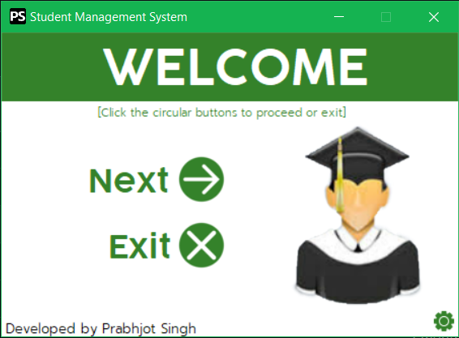
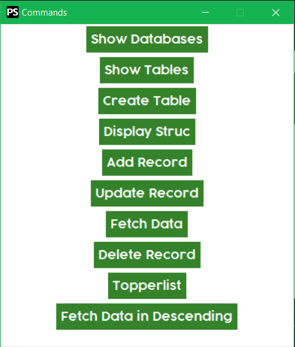

# Student Management System

Student Management System made using Python and some of the built-in modules, data is stored in a database connected to the program.
## Screenshots

## Requirements
- Mysql client
- database named "students_records"
    